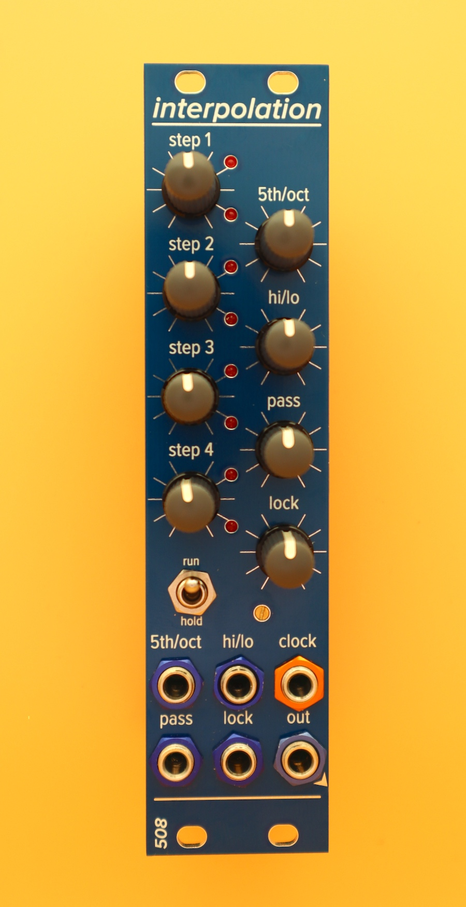

# interpolating sequencer

Set four of the steps manually -- steps 1, 3, 5, 7 -- and it will interpolate the other four steps randomly (up/down a 5th or up/down an octave). The steps are offset, so (for example) step 6 is interpolated randomly based on step 1, etc.

The source of randomness is analog noise. The "random bits" board produces noise, four random voltages, and four random bits which are the result of comparing the random voltages with control voltage. It is designed to be reused in other modules.

The random bits control the interpolated steps, and are stored in a set of flip-flops. There's a "lock" knob, borrowed shamelessly from Tom Whitwell's Turing Machine, which allows you to lock in a sequence that you're enjoying. 

This module, like many of my modules, uses 2mm-pitch male/female headers. Be sure you order/use the right thing!
